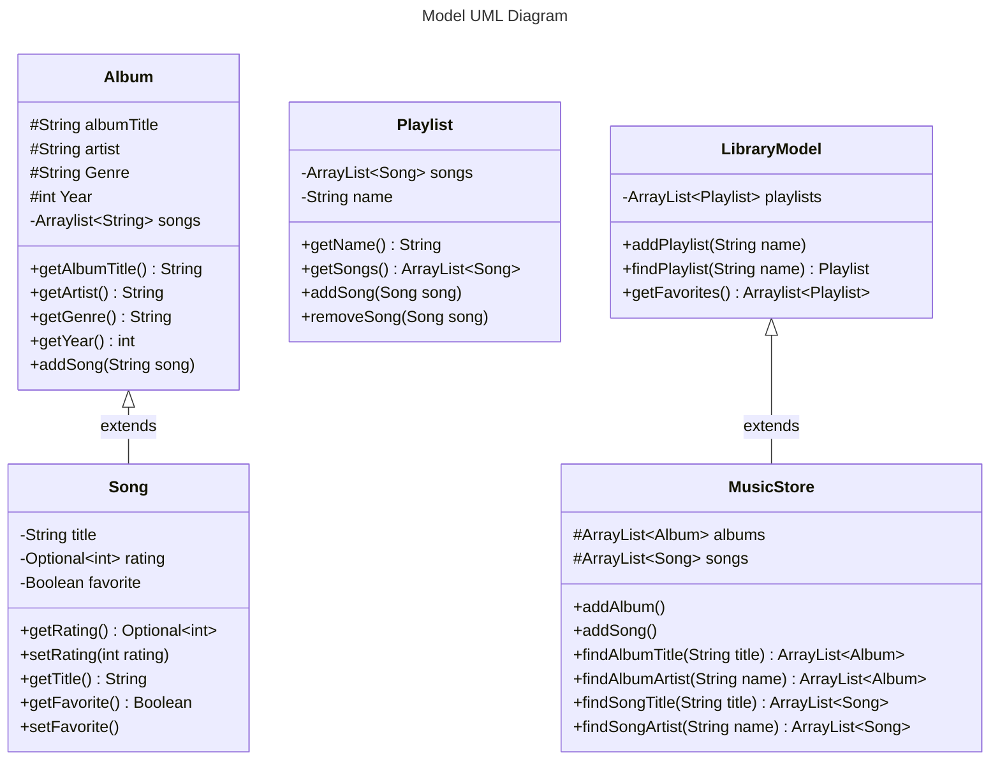

**_IMPORTANT!! THE UML DIAGRAM IS PROGRAMATCIALLY RENDERED WITH MERMAIDJS. GO TO THE [GITHUB](https://github.com/varphi-online/335-LA1/tree/main) TO VIEW_**

# 335-LA1

Long Assignment 1 for CSC335 @ UofA

## Group Members

- Gabe Venegas
- Aidan Fuhrmann

## Video Demo

https://youtu.be/o09k_JYGhto

## Compile to Jar

```bash
javac -d out -sourcepath src src/main/controller/Controller.java &&
jar cfm app.jar MANIFEST.MF -C out . -C src . README.md && java -jar app.jar
```

Then run: `java -jar app.jar`

## UML Diagram


https://mermaid.js.org/syntax/classDiagram.html
