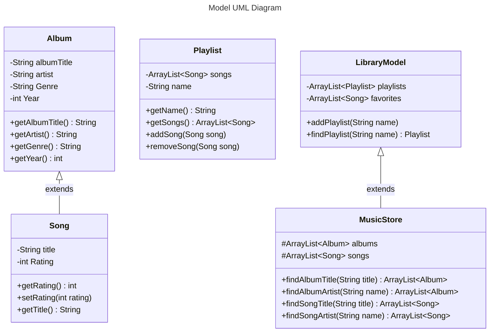

# 335-LA1
Long Assignment 1 for CSC335 (University of Arizona)

https://mermaid.js.org/syntax/classDiagram.html

## Todo:
- Albums should print all of the songs attached to them
- List of favorites

